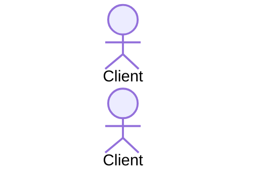
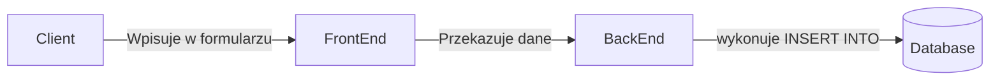
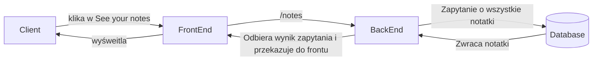
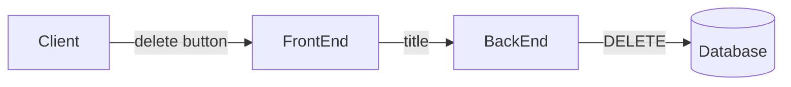
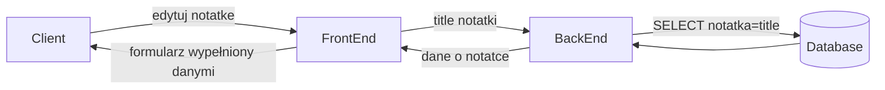
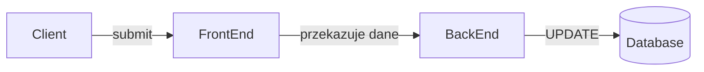

# Dokumentacja
### Identyfikacja zagadnienia biznesowego (problemu)

Nikt nie jest w stanie spamiętać wszystkiego co ma do zrobienia, zwłaszcza po koronawirusie, gdzie połowa społeczeństwa ma problemy z pamięcią! Na pomoc przychodzi prosta i łatwa w obsłudze (oraz implementacji :D) aplikacja **MyNotes**. Aplikacja **MyNotes** pozwala użytkownikowi na założenie konta (wpisując hasło tylko raz!) spisywanie wszystkich swoich myśli, ewentualne edytowanie notatek poźniej oraz usuwanie, gdy już są zbędne.

### Wymagania systemowe i funkcjonalne

##### Wymagania funkcjonalne:
- dodawanie użytkowników
- dodawanie notatek
- usuwanie notatek
- edytowanie notatek
- wyświetlanie notatek
- zarządzanie sesją użytkownika

##### Wymagania techniczne:
- backend: Node.js + Express
- frontend: szablony Pug + CSS 

##### Wymagania dotyczące baz danych:
- relacyjna baza danych: SQLite3 zawiera wszystko co jest potrzebne. Przechowuje dane w tabelach, umożliwia definiowanie relacji pomiędzy nimi oraz zapytania się wykonuje przy użyciu niezawodnego SQLa.

##### Model architektury 
Monolit - **MyNotes** zawiera wszystkie cechy i funkcje w jednej aplikacji i jednej bazie kodu. One mogą zostać zainstalowane w tym samym czasie, wtedy każdy serwer będzie hostem dla kompletnej kopii tej aplikacji. 

### Analiza zagadnienia i jego modelowanie
#### Modele danych:
- entity-relationship model
- encje
- relacje 
#### Diagramy przepływu danych
Oto klient:

##### Funkcjonalność: Dodanie Notatki

##### Funkcjonalność: Wyświetlenie Notatek

##### Funkcjonalność: Usuwanie Notatki


##### Funkcjonalność: Edycja Notatki
##### GET

##### POST


### Implementacja

##### Zarządzanie sesją użytkownika:
- przechowywanie sesji w bazie
- user_id przesyłane

```
if (req.cookies.session) {
        const session_id = req.cookies.session;
        var db = new sqlite3.Database('notes.db');
        let query = `SELECT UserId FROM Sessions WHERE UUID="${session_id}"`;
        db.all(query, (err, rows) => {
            console.log(rows);
            if (rows.length == 1) {
                req.user_id = rows[0].UserId;
                req.authorized = true;
            } else {
                req.authorized = false;
            }
            next();
        });
    } else {
        req.authorized = false;
        next();
    }
```

Weryfikacja w innych funkcjonalnościach:

``` 
if(req.authorized){
      ...
} else {
    req.status = 403;
    res.redirect('/users/login');
    }
```
Wymusza logowanie, jeśli sesja jest nieważna

Expires in : `date.setTime(Date.now() + 1000 * 1200`

##### Dodawanie notatki 
Formularz 
```
router.get('/create', (req, res) => {
    res.render('create_note', {});
});
```
Po wypełnieniu formularza dane są wpisywane do bazy
```
var db = new sqlite3.Database('notes.db');

        let note_title = req.body.title;
        let note_text = req.body.text;
        let note_tags = req.body.tags;

        let query = `INSERT INTO Notes(Title, Text, Tags, "User ID") VALUES("${note_title}", "${note_text}", "${note_tags}", "${req.user_id}")`;

        db.run(query);

        res.redirect('/notes');
```

##### Edycja notatki

```
 var db = new sqlite3.Database('notes.db');
        
        let new_title = req.body.title;
        let new_text = req.body.text;
        let new_tag = req.body.tags;

        let notes_query = `SELECT Title, Text, Tags FROM Notes WHERE Title="${req.params.title}" AND "User ID"=${req.user_id}`;
        db.all(notes_query, (err, data) => {
            if (data.length >= 1) {
                console.log(data);
                if (new_title.length == 0) {
                    new_title = data[0].Title;
                }
                if (new_text.length == 0) {
                    new_text = data[0].Text;
                }
        
                if (new_tag.length == 0) {
                    new_tag = data[0].Tags;
                }
        
                let update_query = `UPDATE Notes SET Title = "${new_title}", Text = "${new_text}", Tags = "${new_tag}" WHERE "User ID"=${req.user_id} AND Title="${req.params.title}";`;
                db.run(update_query);
        
                res.redirect('/notes');
            }
        });
```


##### Usuwanie notatki
Usuwanie notatki o tytule *title*

```
var db = new sqlite3.Database('notes.db');
        let query = `DELETE FROM Notes WHERE Title="${req.params.title}" AND "User ID"=${req.user_id};`;
        db.run(query);

        res.redirect('/notes');
```

##### Rejestracja użytkownika
Dodanie do tabeli Users, od razu dodaje też do tabeli Sessions nową sesje świeżo zarejestrowanego użytkownika, po czym przekierowuje do notatek konkretnego użytkownika
```

    let user_name = req.body.login;
    let user_password = req.body.password;

    var db = new sqlite3.Database('notes.db');
    let query = `SELECT SUM(Id) FROM Users`;
    let num;

    db.all(query, (err, rows) => {
        num = rows[0]['SUM(Id)'] + 1;
        console.log(num);

        let query_register = `INSERT INTO Users(Id, Login, Password) VALUES (${num}, "${user_name}", "${user_password}")`;
        db.run(query_register);

        const session_id = uuid.v4();
        console.log(session_id);

        var date = new Date();
        date.setTime(Date.now() + 1000 * 1200);

        res.cookie("session", session_id,
            {
                secure: false,
                httpOnly: false,
                sameSite: false,
                path: '/',
                expires: date
            });

        let query = `INSERT INTO Sessions (UUID, UserId, Validity) VALUES ("${session_id}", "${num}", "${date.toString()}")`;
        db.run(query);

        res.redirect('/notes');
```


